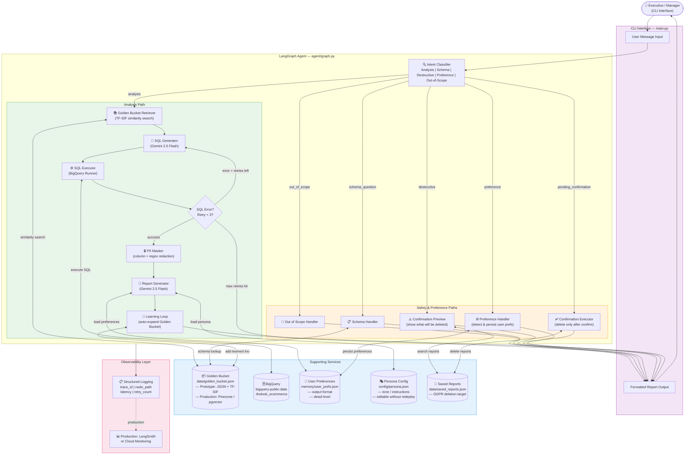
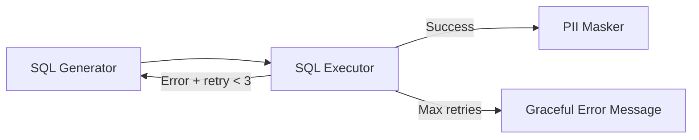

# Architecture Diagram

## Node Routing Logic

| Intent | Route |
|---|---|
| `analysis` | Golden Bucket → SQL Generator → SQL Executor → PII Masker → Report Generator → Learning Loop |
| `schema_question` | Schema Handler (direct from Golden Bucket) |
| `destructive` | Confirmation Preview (2-step flow) |
| `pending_confirmation` | Confirmation Executor (process yes/no) |
| `preference` | Preference Handler (detect changes, persist, confirm) |
| `out_of_scope` | Reject with helpful examples |

## SQL Self-Correction Loop

The error message from BigQuery is injected back into the SQL generation prompt, allowing Gemini to self-correct based on the specific error (syntax, table not found, etc.).
