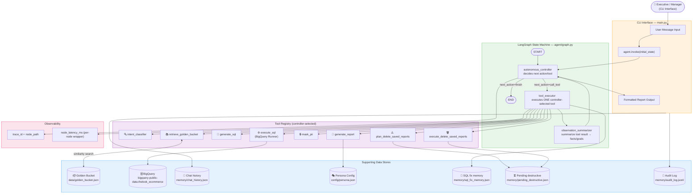
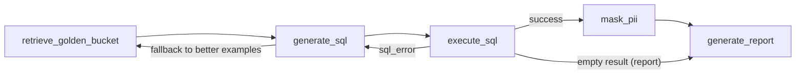

# Architecture Diagram

## Node Routing Logic

| Intent | Route |
|---|---|
| `analysis` | Golden Bucket → SQL Generator → SQL Executor → PII Masker → Report Generator |
| `out_of_scope` | Reject with helpful examples |

## SQL Self-Correction Loop

`execute_sql` surfaces BigQuery errors into `sql_error` / `sql_error_signature`, which the controller feeds back into the `generate_sql` prompt for targeted self-correction (syntax/time-window/fallback handling).
